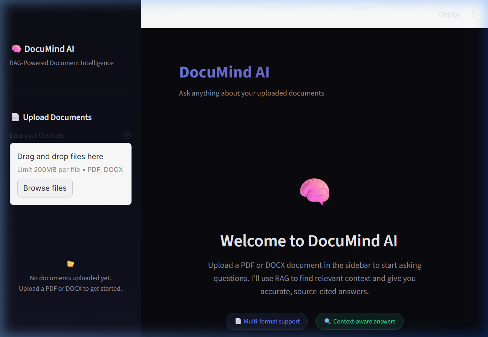

# 🧠 DocuMind AI – RAG-Powered Document Q&A System

A production-quality **Retrieval-Augmented Generation (RAG)** system that lets you upload PDF/DOCX documents and ask questions about them conversationally. Built with LangChain, Google Gemini, ChromaDB, and Streamlit.




---

## ✨ Features

- **📄 Multi-format Document Upload** – Supports PDF and DOCX files with drag-and-drop
- **🔍 Intelligent Retrieval** – Semantic search over document chunks using Gemini embeddings + ChromaDB
- **💬 Conversational Memory** – History-aware Q&A with context reformulation across turns
- **📚 Source Citations** – Every answer cites the exact document and page it came from
- **🎨 Premium UI** – Glassmorphism dark theme with gradient accents and smooth animations
- **⚡ Multi-document Support** – Upload multiple files and query across all of them simultaneously

---

## 🏗️ Architecture

```
User Query
    │
    ▼
┌─────────────────────┐
│  History-Aware       │  Reformulates question using
│  Retriever           │  conversation context
└──────────┬──────────┘
           │
           ▼
┌─────────────────────┐
│  ChromaDB            │  Semantic similarity search
│  Vector Store        │  over document embeddings
└──────────┬──────────┘
           │
           ▼
┌─────────────────────┐
│  Gemini 2.0 Flash    │  Generates grounded answer
│  (LLM)               │  with source citations
└─────────────────────┘
```

---

## 📁 Project Structure

```
├── app.py                  # Streamlit UI entry point
├── config.py               # Centralized configuration
├── requirements.txt        # Python dependencies
├── .env.example            # API key template
├── rag/
│   ├── __init__.py
│   ├── document_loader.py  # PDF/DOCX text extraction
│   ├── chunker.py          # Text chunking with overlap
│   ├── vector_store.py     # ChromaDB + Gemini embeddings
│   └── query_engine.py     # Conversational RAG chain
└── assets/
    └── style.css           # Premium dark theme CSS
```

---

## 🚀 Quick Start

### Prerequisites

- Python 3.10+
- A [Google Gemini API key](https://aistudio.google.com/apikey)

### 1. Clone the repository

```bash
git clone https://github.com/mrudulj-coder/RAG-powered-Document-Q-A-System.git
cd RAG-powered-Document-Q-A-System
```

### 2. Install dependencies

```bash
pip install -r requirements.txt
```

### 3. Configure API key

```bash
cp .env.example .env
# Edit .env and add your Google Gemini API key
```

### 4. Run the application

```bash
streamlit run app.py
```

The app will open at `http://localhost:8501`.

---

## 🎯 Usage

1. **Upload Documents** – Use the sidebar to upload one or more PDF/DOCX files
2. **Ask Questions** – Type your question in the chat input
3. **View Sources** – Expand the "📚 View Sources" section under each answer to see cited passages
4. **Follow-up** – Ask follow-up questions — the system remembers conversation context
5. **Manage** – Use "Clear All Documents" to reset the knowledge base

---

## 🔧 Configuration

All settings are centralized in `config.py`:

| Parameter | Default | Description |
|-----------|---------|-------------|
| `LLM_MODEL` | `gemini-2.0-flash` | Gemini model for answer generation |
| `EMBEDDING_MODEL` | `models/gemini-embedding-001` | Gemini model for embeddings |
| `CHUNK_SIZE` | `1000` | Characters per text chunk |
| `CHUNK_OVERLAP` | `200` | Overlap between chunks |
| `TOP_K` | `5` | Number of chunks retrieved per query |
| `TEMPERATURE` | `0.3` | LLM creativity (0 = focused, 1 = creative) |

---

## 🛠️ Tech Stack

| Component | Technology | Purpose |
|-----------|-----------|---------|
| **LLM Orchestration** | LangChain | RAG chain, retrieval, prompt management |
| **Language Model** | Google Gemini 2.0 Flash | Answer generation |
| **Embeddings** | Gemini Embedding-001 | Document vectorization |
| **Vector Store** | ChromaDB | Persistent semantic search |
| **Document Parsing** | PyPDF, python-docx | PDF/DOCX text extraction |
| **UI Framework** | Streamlit | Interactive web interface |

---

## 📜 License

This project is open source and available under the [MIT License](LICENSE).
